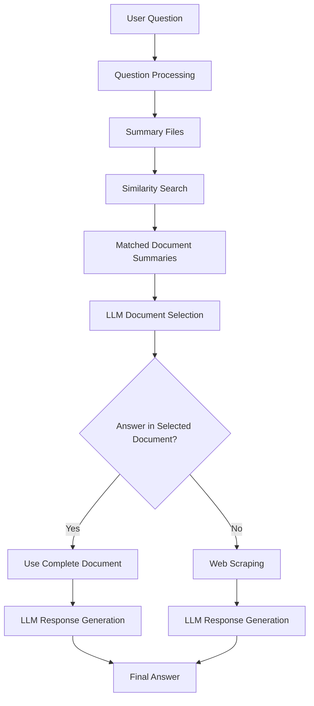
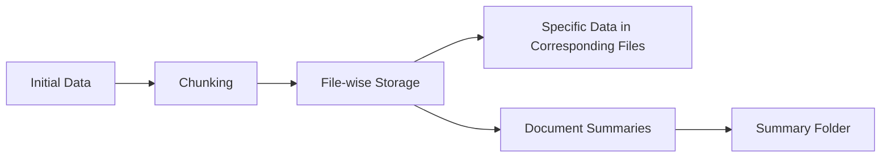
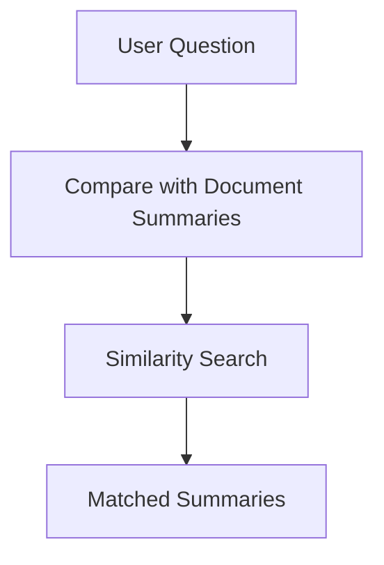
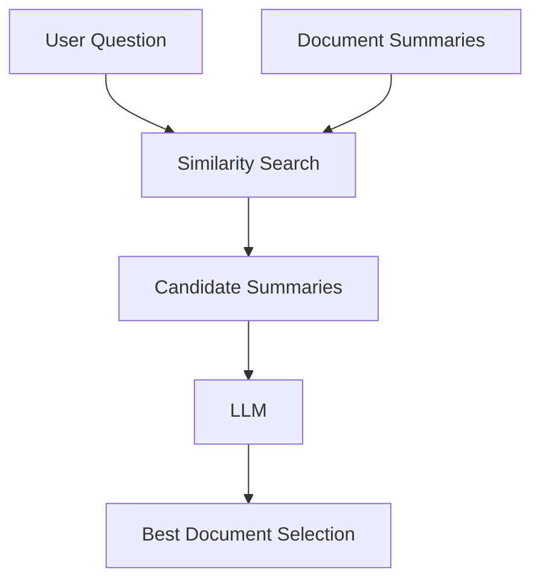
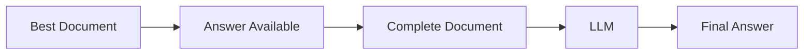
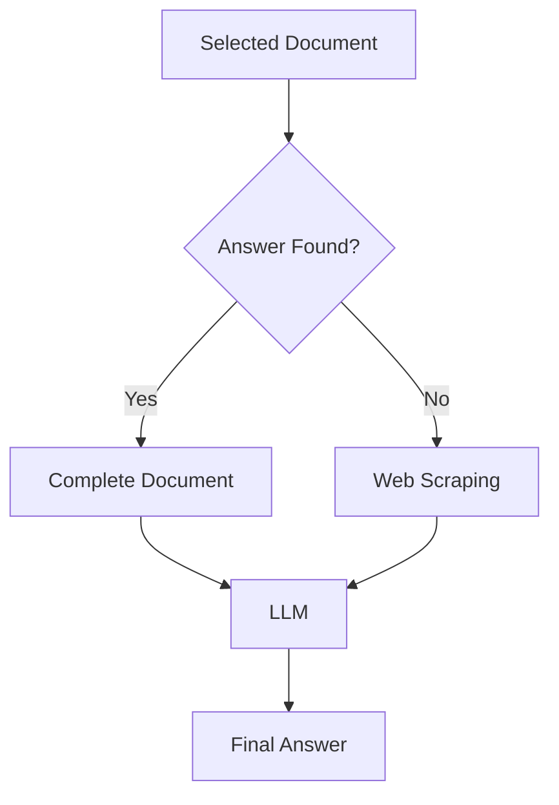
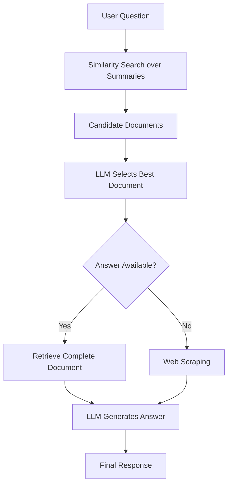

# Document-Grounded AI Chatbot

A document-grounded question-answering system that retrieves the most relevant stored information for a user question and uses an LLM to generate the final response.

## Overview

The system organizes its knowledge as pre-processed, chunked data stored file-wise. Each specific type of information is maintained in its corresponding file, while document summaries are maintained separately for efficient retrieval.

The main query workflow is:

## Key Features

- Pre-chunked knowledge stored file-wise.
- Separate storage of specific information in corresponding files.
- Summary-based document retrieval.
- Similarity search between the user question and document summaries.
- LLM-assisted selection of the most relevant document.
- Complete-document context when the selected document contains the answer.
- Web-scraping fallback when the required answer is not available in the stored document knowledge.

## Data Organization

The data is chunked initially and then maintained in a file-wise structure. Instead of treating all stored content as one undifferentiated collection, information is associated with its relevant file.

Document summaries are maintained in a dedicated `summary` folder. These summaries act as the first retrieval layer and allow the system to identify potentially relevant documents before processing the complete document.

## Retrieval Technique

Retrieval is the central part of the system. Rather than directly searching the complete document collection for every question, the system first compares the question with the summaries of available documents.

### 1. Question-to-Summary Matching

When a user submits a question, the question is matched against the summaries stored in the `summary` folder.

The similarity search identifies summaries that are semantically close to the user's question.

This provides a lightweight first-stage retrieval mechanism because summaries represent the content of their corresponding documents without requiring the complete documents to be searched at the initial stage.

### 2. LLM-Based Document Selection

The matched summaries are then used by the LLM to determine which document is the best candidate for answering the question.

The LLM therefore acts as a second-stage decision component after similarity-based retrieval.

### 3. Complete-Document Answer Generation

After the best document is identified, the system checks whether the required answer is available in that document.

If the answer is present, the complete document is used as the context for generating the response.

Using the complete selected document allows the generation stage to access the broader context surrounding the information rather than relying only on the summary that was used for retrieval.

### 4. Web-Scraping Fallback

If the required answer cannot be found in the selected stored document, the system falls back to web scraping.

This creates a two-level knowledge strategy:

**Stored Documents → Web Information**

The stored document knowledge is used first, while web scraping provides an alternative source when the required information is not available in the stored content.

## Retrieval Advantages and Limitations

| Aspect | Advantage | Limitation |
|---|---|---|
| Summary retrieval | Reduces the initial search space | Depends on the quality of summaries |
| Similarity search | Quickly identifies semantically related documents | Similarity alone may select an imperfect candidate |
| LLM selection | Adds semantic reasoning to document selection | Selection depends on LLM behavior |
| Complete-document context | Preserves broader document context for generation | Processing a complete document can require more context |
| File-wise organization | Keeps specific information separated and organized | Requires consistent file organization |
| Web fallback | Provides information when stored documents do not contain the answer | Depends on successful web scraping and available web content |

## Query-to-Response Workflow

## Chunking and Retrieval Relationship

The system performs chunking before the retrieval stage and stores the resulting information in a file-wise structure. Retrieval does not begin by directly comparing the user question against every complete stored document. Instead, document summaries provide the initial retrieval layer.

The resulting relationship is:

**Initial Chunking → File-wise Storage → Document Summaries → Similarity Search → LLM Document Selection → Complete Document / Web Scraping → Answer Generation**

This separation allows the summary layer to perform initial document identification while the selected document can provide broader context for final answer generation.

## Limitations

- Retrieval quality depends on the quality and representativeness of document summaries.
- Similarity matching may return documents that are related to, but do not fully answer, the question.
- The final document selection depends on the LLM's interpretation of the candidate summaries.
- Complete-document processing can require more context than processing only a small retrieved chunk.
- The web-scraping fallback depends on the availability and accessibility of relevant web information.

## Conclusion

The system uses a layered retrieval strategy rather than directly generating an answer from the entire knowledge base. Data is initially chunked and maintained file-wise, with document summaries stored in a dedicated summary layer.

For a user question, similarity search first matches the question against document summaries. The LLM then identifies the best candidate document. When that document contains the required information, the complete document is used for answer generation. If the information is unavailable, the system uses web scraping as a fallback source.

**Core workflow:**

`Question → Summary Similarity Search → LLM Document Selection → Complete Document → Answer`

or, when the stored document does not contain the answer:

`Question → Summary Similarity Search → LLM Document Selection → Web Scraping → Answer`
